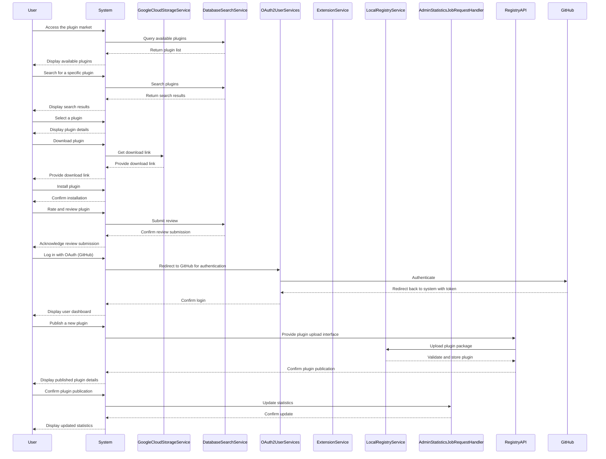

```mermaid
sequenceDiagram
    participant User
    participant System
    participant GoogleCloudStorageService
    participant DatabaseSearchService
    participant OAuth2UserServices
    participant ExtensionService
    participant LocalRegistryService
    participant AdminStatisticsJobRequestHandler
    participant RegistryAPI

    User->>System: Access the plugin market
    System->>DatabaseSearchService: Query available plugins
    DatabaseSearchService-->>System: Return plugin list
    System-->>User: Display available plugins

    User->>System: Search for a specific plugin
    System->>DatabaseSearchService: Search plugins
    DatabaseSearchService-->>System: Return search results
    System-->>User: Display search results

    User->>System: Select a plugin
    System-->>User: Display plugin details

    User->>System: Download plugin
    System->>GoogleCloudStorageService: Get download link
    GoogleCloudStorageService-->>System: Provide download link
    System-->>User: Provide download link

    User->>System: Install plugin
    System-->>User: Confirm installation

    User->>System: Rate and review plugin
    System->>DatabaseSearchService: Submit review
    DatabaseSearchService-->>System: Confirm review submission
    System-->>User: Acknowledge review submission

    User->>System: Log in with OAuth (GitHub)
    System->>OAuth2UserServices: Redirect to GitHub for authentication
    OAuth2UserServices->>GitHub: Authenticate
    GitHub-->>OAuth2UserServices: Redirect back to system with token
    OAuth2UserServices-->>System: Confirm login
    System-->>User: Display user dashboard

    User->>System: Publish a new plugin
    System->>RegistryAPI: Provide plugin upload interface
    RegistryAPI->>LocalRegistryService: Upload plugin package
    LocalRegistryService-->>RegistryAPI: Validate and store plugin
    RegistryAPI-->>System: Confirm plugin publication
    System-->>User: Display published plugin details

    User->>System: Confirm plugin publication
    System->>AdminStatisticsJobRequestHandler: Update statistics
    AdminStatisticsJobRequestHandler-->>System: Confirm update
    System-->>User: Display updated statistics
```